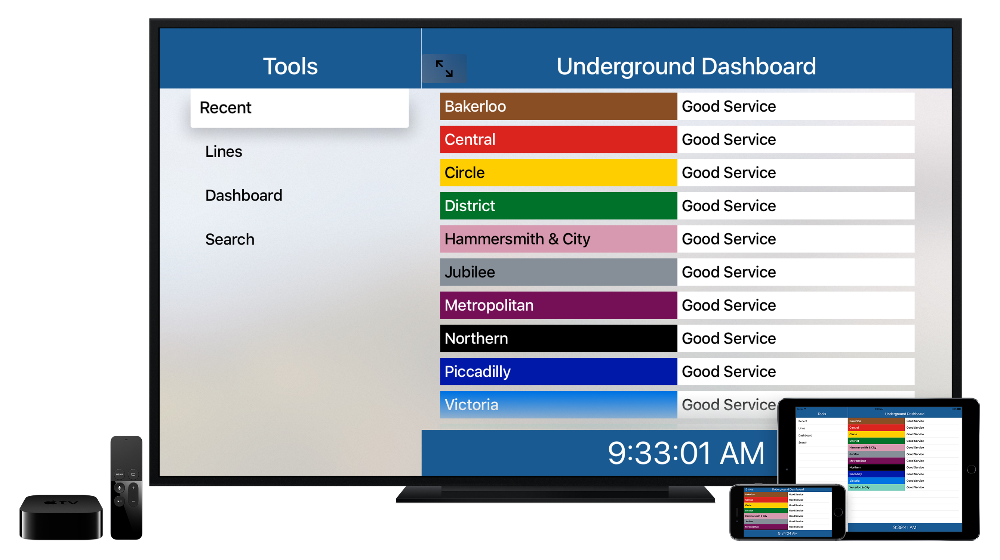

# Brunel

[](http://twitter.com/ustwo)

This project is a demonstration of organisation for an app that runs on both iOS and tvOS platforms using a unified code base. It is built using Swift 2.1 by iOS developers at [ustwo](https://ustwo.com/).

In the demo, the user can access live feeds of the current status of different lines across Transport for London's network.



## Dependencies

- Ruby
- [Xcode 7.2](https://itunes.apple.com/gb/app/xcode/id497799835?mt=12#)
- [CocoaPods 1.1.0.rc.3](https://github.com/CocoaPods/CocoaPods/releases/tag/1.1.0.rc.3)
	- [Alamofire](https://github.com/Alamofire/Alamofire)
	- [Moya](https://github.com/Moya/Moya)
	- [Result](https://github.com/antitypical/Result)
	- [SVProgressHUD](https://github.com/SVProgressHUD/SVProgressHUD)
	- [SwiftyJSON](https://github.com/SwiftyJSON/SwiftyJSON)
- [TfL API](https://api.tfl.gov.uk/)

## Usage

### Running the app with Xcode

You should also then ensure you have all the required pods by running the following terminal command from the project folder:

```bash
$ gem install bundler
$ bundle install
$ pod install
```

You can then open the workspace file `TFL Demo.xcworkspace`.

You will also need to register for a key for the [TfL API](https://api.tfl.gov.uk/). This should be included in the `tflconfig.plist` file for use by the app. A template `plist` file has been provided.

## Architecture

### Organisation

We have a single project with a target for each platform. There are three folders for source code and resources: `Sources` which is for files common to all platforms, `Sources-iOS` for files unique to iOS, and `Sources-tvOS` for files unique to tvOS.

### API

Data is fetched from TfL servers using the `TFLRestAPI` shared instance. Each section of the API has its own definition (e.g. `TFLLineAPI`) and Moya provider. For more information on the API itself, see [TfL's website](https://api.tfl.gov.uk/).

### Constants

All constants are organised into `struct` to provide grouping and scoping of the variables.

### Controller

The app is based on a `UISplitViewController` design pattern. The root view controller of the master side is `ToolsTableViewController`. This allows the user to drill down into the correct tool to display the information desired.

There are two controllers that are used on the detail side of the split view - `LineDetailViewController` and `DashboardTableViewController`. The line detail shows the current status of a single line of transport on TfL's network. The dashboard scrolls through a list of all lines for a given mode of transport and displays their current status.

See also the [Project Diagram](./Docs/Project%20Diagram.pdf) for a high-level overview of the main controllers for the project.

### Extensions

There are two small extensions to first- and third-party frameworks. The first provides `String` descriptions to Moya's `Error` object. The second adds a function to `UIColor` to specify whether the color is light or dark according to W3C specifications.

### Model

Most model objects are deserializations of the JSON returned from the TfL API. The model object exposes the data via constant properteries and is capable of deserializing itself directly from the JSON.

There are three `enum` used to provide clarity around the mode of transportation - `TFLModes`, `TFLNationalRail`, and `TFLUnderground`. Each of these also have convenience methods to assist with providing a branded UI for the given mode.

The last model object is `Settings` which is where all `NSUserDefaults` are stored for the app (such as the lines recently viewed by the user).

### View Model

Extensions are provided on the `TFLLine` and `TFLLineSearch` model objects to provide configuration of table view cells in which to display their data.

## Open Radars

- [**24362789**](http://openradar.appspot.com/24454686): Creating a `UISplitViewController` fully programmatically has layout issues when using a `UINavigationController` on both primary and secondary views. The view on the secondary side extends under an *opaque* `UINavigationBar` until the screen is rotated.
- [**24363372**](http://openradar.appspot.com/24363732): When you focus on a `UIBarButtonItem` that is an icon, even a system provided one such as Compose, the white icon disappears into the white background of the button. This is in contrast to text based `UIBarButtonItem` where the text changes colour to black on focus.
- [**24454686**](https://openradar.appspot.com/24454686): A subclass of a generic superclass does not respond to a selector that points to a function that exists in an extension of the subclass. This prevents using a target-action pattern with functions in the extension.

## License

Brunel is released under the MIT license. See LICENSE for details.
